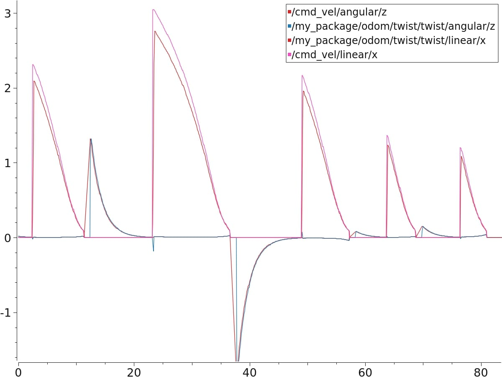
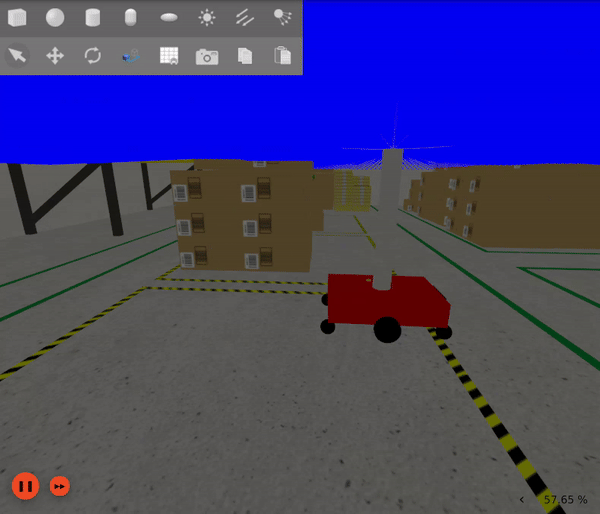

# ROS2 Differential Drive Robot Simulation with Multi-Sensor Suite and Waypoint Navigation

## About

The `simple_amr_sim` ROS2 package models a 4-wheel differential drive robot equipped with various sensors, including an RGBD camera, a 3D LiDAR, an IMU (Inertial Measurement Unit), a GPS (Global Positioning System), and 4 caster wheels. This comprehensive sensor suite enables the robot to perceive its environment effectively for navigation and manipulation tasks.

Additionally, the package includes a waypoint controller, allowing users to input waypoints for autonomous navigation. The differential drive robot autonomously moves to the specified waypoints, demonstrating its navigation capabilities within the simulated environment.

The goal is to provide an efficient and flexible platform for simulation-based development and testing of robotics algorithms and applications.

## Features
- Simulation of a 4-wheel differential drive robot in Gazebo Fortress environment.
- Integration of essential sensors:
  - RGBD camera for visual perception.
  - 3D LiDAR for environmental mapping and obstacle detection.
  - IMU for orientation estimation and motion tracking.
  - GPS for global position localization.
  - 4 caster wheels for enhanced mobility and stability.
- Waypoint controller for autonomous navigation:
  - Input waypoints for the robot to navigate autonomously within the simulated environment.
  - Demonstrates path planning and control algorithms.


## Building Docker 
build the `simple_amr_sim` package within a Docker environment, follow these steps:

1. Build the Docker image using the following command:
```
$ docker build -t simple_amr_project .
```
## Running Instruction

1. Navigate to the folder `docker_scripts/run_scripts`.
```
$ cd docker_scripts/run_scripts
```

2. Run the script `./devel.sh` to initialize the Docker environment.
```
$ ./devel.sh
```

3. Run this command to spawn robot in gz and start waypoint controller 
```
$ ./run_sim_and_controller.sh
```
## Controlling robot manually

After launching the Gazebo Ignition simulation of the robot

1. To control the robot, run this:
```
$ ros2 run teleop_twist_keyboard teleop_twist_keyboard
```


## Plotjuggler Visualisation

1. Installing Plotjuggler
```
$ sudo apt install ros-$ROS_DISTRO-plotjuggler-ros
```

2. Running Plotjugger
```
$ ros2 run plotjuggler plotjuggler
```

3. Example 
        


### Rviz Visualization

1. Run this command:
```
$ ros2 launch simple_amr_sim rviz.launch.py
``` 

## Configuration
The `simple_amr_sim` package allows for configuration of height parameters of 3D Lidar:
Example
```
ros2 launch simple_amr_sim gz.launch.py lidar_height:=2
```

The `amr_control` package allows for passing path of waypoints to traverse :
Example
```
ros2 launch amr_control controller.launch.py waypoints_file:=src/amr_control/config/custom_waypoints.yaml
```


3. Define the waypoints file inside `workspace/arm_control/config/`

## ROS2 APIs and Ignition Gazebo Topics Mapping

The `simple_amr_sim` package utilizes ROS2 topics and services to control the behavior of the simulated robot. Key topics and services include:

- `/clock`: Provides simulation time information.
- `/simple_amr_sim/odom`: Publishes robot pose odometry data.
- `/tf`: Broadcasts transformation information between different frames in the robot's environment.
- `/simple_amr_sim/scan`: Supplies Lidar sensor data for environment perception.
- `/simple_amr_sim/stereo_camera/right/image_raw`: Provides raw image data from the right camera of a stereo camera setup.
- `/simple_amr_sim/stereo_camera/left/image_raw`: Provides raw image data from the left camera of a stereo camera setup.
- `/simple_amr_sim/kinect_camera/camera_info`: Provides camera calibration information for the depth camera.
- `/simple_amr_sim/stereo_camera/left/camera_info`: Provides camera calibration information for the left camera of the stereo camera setup.
- `/simple_amr_sim/stereo_camera/right/camera_info`: Provides camera calibration information for the right camera of the stereo camera setup.
- `/simple_amr_sim/kinect_camera/points`: Provides point cloud data from the depth camera sensor.
- `/simple_amr_sim/imu`: Publishes Inertial Measurement Unit (IMU) data for orientation and acceleration.
- `/simple_amr_sim/navsat`: Supplies GPS data for localization.
- `/simple_amr_sim/joint_states`: Publishes joint states of the robot model.
- `/simple_amr_sim/cmd_vel`: Allows for sending velocity commands to control the robot's movement.


For detailed usage instructions, refer to the official ROS2 documentation.

The `simple_amr_sim` package utilizes ROS2 topics and services to control the behavior of the simulated robot. Below is a mapping of ROS2 topics to Ignition Gazebo topics:

| ROS2 Topic                                      | Ignition Gazebo Topic                              |
|-------------------------------------------------|----------------------------------------------------|
| `/clock`                                        | `rosgraph_msgs/msg/Clock` → `ignition.msgs.Clock` |
| `/simple_amr_sim/odom`                              | `nav_msgs/msg/Odometry` → `ignition.msgs.Odometry`|
| `/tf`                                           | `tf2_msgs/msg/TFMessage` → `ignition.msgs.Pose_V` |
| `/simple_amr_sim/scan`                              | `sensor_msgs/msg/PointCloud2` → `ignition.msgs.PointCloudPacked` |
| `/simple_amr_sim/stereo_camera/right/image_raw`     | `sensor_msgs/msg/Image` → `ignition.msgs.Image`   |
| `/simple_amr_sim/stereo_camera/left/image_raw`      | `sensor_msgs/msg/Image` → `ignition.msgs.Image`   |
| `/simple_amr_sim/stereo_camera/right/image_raw`     | `sensor_msgs/msg/Image` → `ignition.msgs.Image`   |
| `/simple_amr_sim/kinect_camera/camera_info`         | `sensor_msgs/msg/CameraInfo` → `ignition.msgs.CameraInfo` |
| `/simple_amr_sim/stereo_camera/left/camera_info`    | `sensor_msgs/msg/CameraInfo` → `ignition.msgs.CameraInfo` |
| `/simple_amr_sim/stereo_camera/right/camera_info`   | `sensor_msgs/msg/CameraInfo` → `ignition.msgs.CameraInfo` |
| `/simple_amr_sim/kinect_camera/points`              | `sensor_msgs/msg/PointCloud2` → `ignition.msgs.PointCloudPacked` |
| `/simple_amr_sim/imu`                               | `sensor_msgs/msg/Imu` → `ignition.msgs.IMU`       |
| `/simple_amr_sim/navsat`                            | `sensor_msgs/msg/NavSatFix` → `ignition.msgs.NavSat` |
| `/simple_amr_sim/joint_states`                      | `sensor_msgs/msg/JointState` → `ignition.msgs.Model` |
| `/simple_amr_sim/cmd_vel`                           | `geometry_msgs/msg/Twist` → `ignition.msgs.Twist` |

These mappings are established through the `gz_ros2_bridge` node which facilitates communication between ROS2 and Ignition Gazebo. Adjustments can be made based on specific requirements or configurations.

## Videos/Images
|              |               |  
| :----------------------------------: | :------------------------------------: |
|          _Gazebo Ign_                |                _Rviz_	                | 

## References
- [GitHub: blackcoffeerobotics/bcr_bot](https://github.com/blackcoffeerobotics/bcr_bot/tree/ros2)
- [Medium: How to Subscribe to Ignition Gazebo Topics using ROS2](https://medium.com/@geetkal67/how-to-subscribe-to-ignition-gazebo-topics-using-ros2-8bcff7a0242e)
